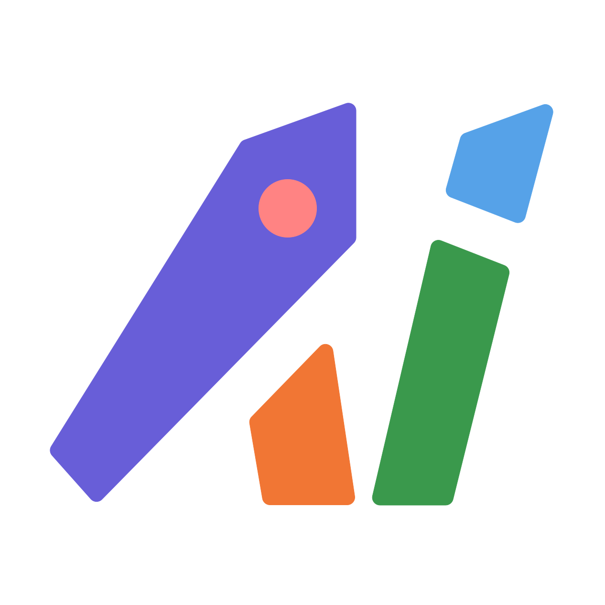
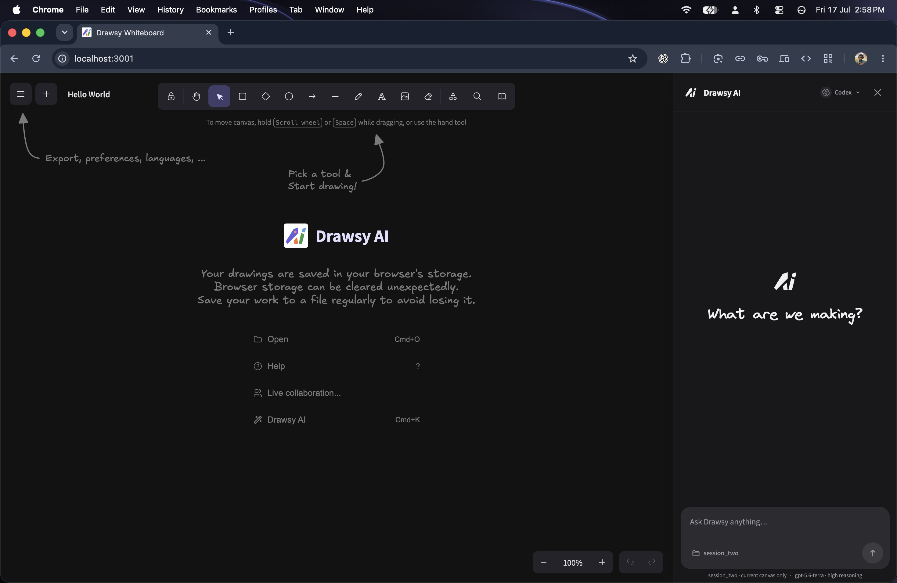
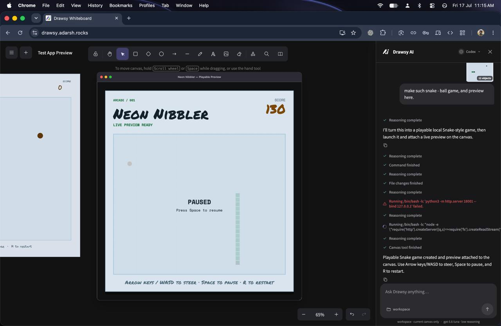
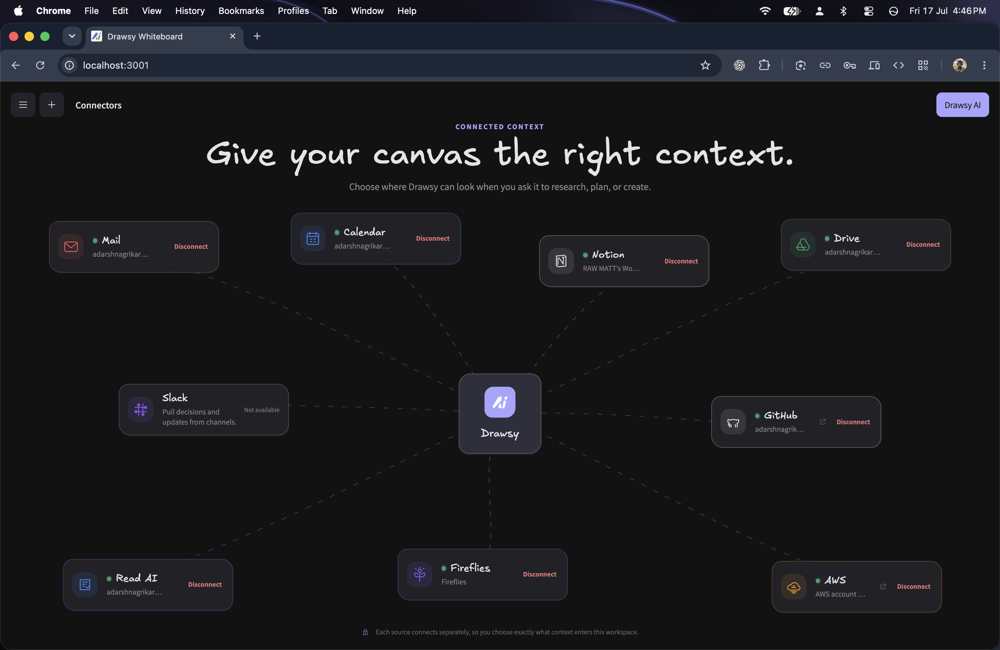
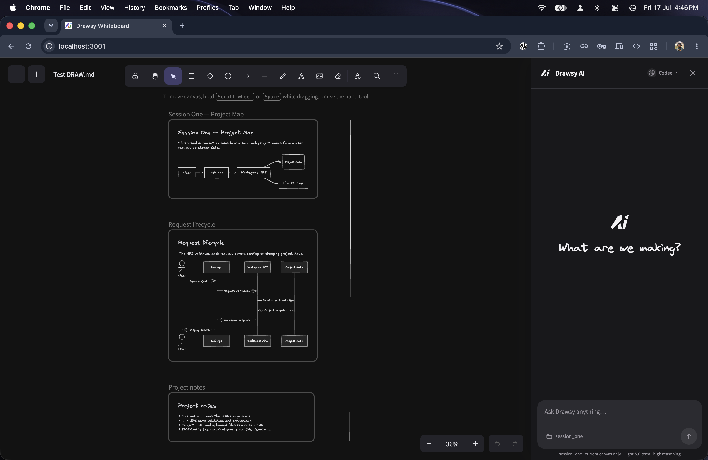
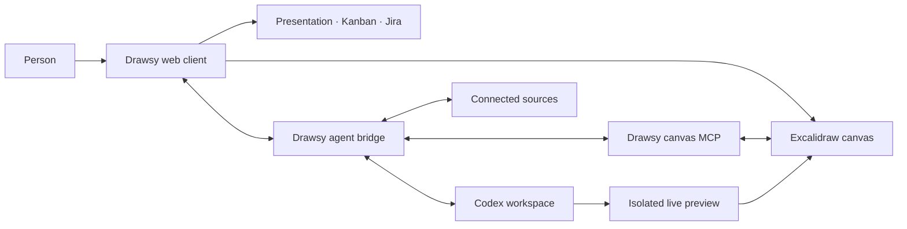
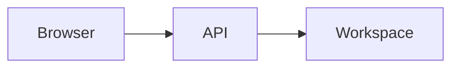

<p align="center">
  
</p>

<h1 align="center">Drawsy AI</h1>

<p align="center">
  <strong>A visual workspace where ideas, project context, connected tools, and a coding agent meet on an infinite canvas.</strong>
</p>

<p align="center">
  <a href="https://drawsy.adarsh.rocks">Live demo</a>
  · <a href="./BUILD_WEEK.md">Build Week record</a>
  · <a href="./CONTRIBUTING.md">Contributing</a>
  · <a href="./SECURITY.md">Security</a>
  · <a href="https://github.com/excalidraw/excalidraw">Excalidraw</a>
</p>

<p align="center">
  <a href="./LICENSE"></a>
  <a href="https://openai.devpost.com/"></a>
  
</p>



## What is Drawsy?

Drawsy turns the whiteboard into an active workspace. The same hand-drawn canvas can hold diagrams, presentations, project plans, source material, generated images, and a live application preview. Its side-by-side AI surface can understand the current workspace, use explicitly attached context, and propose or apply editable canvas changes.

The product combines:

- the Excalidraw editor and its open, editable scene model;
- Drawsy workspaces for canvases, presentations, Kanban, Jira, and connected sources;
- a workspace-aware Codex experience with visible tool progress and Markdown responses;
- deterministic visual documentation through `DRAW.md`;
- real-time collaboration and remote asset storage; and
- local coding workspaces with interactive previews embedded back into the canvas.

## #Build Week Special

Drawsy existed before OpenAI Build Week. In accordance with the [official rules](https://openai.devpost.com/rules), the submission claims only the meaningful extensions created after **July 13, 2026 at 9:00 AM PT**.

During that window, Drawsy gained:

- **A native AI sidebar** that makes room beside the workspace instead of covering it, with Codex controls, streaming activity, rich Markdown, copy actions, attachments, and workspace-aware states.
- **A canvas protocol for agents** to read and edit the current canvas or presentation without receiving automatic access to unrelated workspaces.
- **Multimodal selection context**: select canvas elements and press `C` to attach a visual crop plus the original source images, allowing annotations and editable image sources to travel together.
- **Connector-aware prompts** with account-aware `@` tags for sources such as Gmail, Calendar, Drive, GitHub, Notion, meeting tools, and AWS. Access is added to a turn; ordinary prompts remain ordinary prompts.
- **Drawsy resource tags** for local Kanban and Jira context and actions.
- **`DRAW.md` rendering** that converts mixed Markdown and Mermaid into normal editable Excalidraw elements, places them beside existing work, and updates only its own generated content.
- **Interactive live previews**: an agent-started local app can appear as a movable, resizable browser window on the infinite canvas while preserving hot reload.
- **Presentation-aware assistance**, theme synchronization, clearer tool states, and targeted reliability fixes around sync and canvas responses.

### Three Drawsy-native innovations

These are not disconnected demos. Each one closes a different gap between thinking, source context, and working software while keeping the result inside the same visual workspace.

#### The canvas can hold the running software

Codex can build or run a project in the selected workspace and attach its live local service as an interactive canvas element. The preview moves and resizes like part of the board, keeps framework hot reload, receives its own isolated runtime port, and lives in session-local preview state instead of being synchronized as permanent canvas data.



#### Connected context is visible and optional

Drawsy separates connecting an account from using it in a prompt. People can see which sources are connected, then explicitly attach the relevant account or capability with `@` only when a task needs it. The model receives a short-lived grant for that turn—not the provider's OAuth credentials—and an untagged conversation remains unaffected.



#### A project document can become an editable visual map

`DRAW.md` combines readable Markdown with Mermaid diagrams. Opening a folder renders that document as native Excalidraw frames, text, and geometry beside existing work—without AI or network access. The file remains canonical; later edits refresh only its generated elements in place.



### Build Week repository set

This frontend and five supporting repositories form the complete implementation used for judging. The supporting repositories are **private for now** because they contain deployment and security-sensitive service code; judge access is granted directly. They may be published later after a dedicated security and release review.

- [`drawsy-ai-backend`](https://github.com/adarshnagrikar14/drawsy-ai-backend) — authenticated workspaces, Kanban/Jira resources, connectors, grants, and provider execution.
- [`drawsy-ai-mcp`](https://github.com/adarshnagrikar14/drawsy-ai-mcp) — surface-scoped Drawsy MCP, Codex app-server bridge, sandbox, canvas tools, and live-preview runtime.
- [`draws-ai-wss`](https://github.com/adarshnagrikar14/draws-ai-wss) — Excalidraw-compatible real-time collaboration service.
- [`drawsy-ai-store`](https://github.com/adarshnagrikar14/drawsy-ai-store) — encrypted share-link scene storage.
- [`drawsy-ai-libraries`](https://github.com/adarshnagrikar14/drawsy-ai-libraries) — Drawsy's Excalidraw-compatible library catalog.

The precise qualifying boundary, commit range, engineering record, and Codex collaboration are documented in [BUILD_WEEK.md](./BUILD_WEEK.md).

## How it works



This repository contains the Drawsy web client and the Excalidraw foundation it extends. Supporting backend, collaboration, storage, signer, and MCP services are maintained separately; private repositories are shared directly with the hackathon judges.

## Try it

The fastest judge and reviewer path is the hosted product:

**[Open Drawsy](https://drawsy.adarsh.rocks)**

Suggested flow:

1. Sign in and create or open a canvas.
2. Open **Drawsy AI** from the top-right action or with `Cmd/Ctrl + K`.
3. Ask it to inspect or modify the current canvas.
4. Select a meaningful group of elements and press `C`; the visual context appears in the composer.
5. If a source is connected, type `@` and choose it for that prompt.
6. Open a local folder containing `DRAW.md` to render its project map, or ask Codex to run an app and attach its live preview.

Some connector scenarios require the corresponding account to be connected. The core canvas and UI remain usable without connectors.

## Local development

### Requirements

- Node.js 18 or newer
- Yarn 1.22.22

### Start the web client

```bash
git clone https://github.com/adarshnagrikar14/excal-ai.git
cd excal-ai
yarn install
yarn start
```

The development server uses `http://localhost:3001` with the checked-in development configuration.

### Validate a change

```bash
yarn test:typecheck
yarn test:app --watch=false
yarn build
```

The standalone editor can be developed from this repository. AI, connectors, collaboration, remote storage, and hosted live previews require their supporting services; use the hosted demo when evaluating the complete product without rebuilding the stack.

## `DRAW.md`

`DRAW.md` is Drawsy's deterministic visual project document. It is deliberately not an AI-only format: the file remains canonical, Markdown stays readable, Mermaid becomes editable canvas geometry, and existing canvas content is left alone.

````md
# Request lifecycle

The API validates each request before reading project data.



## Notes

- The browser owns the visible experience.
- The API owns validation and permissions.
````

See the complete [DRAW.md v1 contract](./research/draw-md-v1-spec.md).

## Project principles

- **Context is explicit.** The active surface and user attachments define what the agent can see.
- **The canvas stays editable.** AI output should become native elements whenever possible.
- **Deterministic when deterministic is better.** `DRAW.md` does not require AI or network access.
- **Local work stays local by default.** Coding workspaces and live-preview processes are isolated from shared canvas data.
- **No forced workflow.** Connectors, tags, previews, and generated context add capability without changing an ordinary chat request.

## Excalidraw foundation

Drawsy is built on the excellent [Excalidraw](https://github.com/excalidraw/excalidraw) open-source project. It retains Excalidraw's hand-drawn editor, scene model, packages, history, and MIT license, then adds the Drawsy product and agent experience around that core.

This repository is not affiliated with or endorsed by Excalidraw. Upstream copyright and license notices remain intact. For the original editor, npm package, documentation, and community, visit [excalidraw.com](https://excalidraw.com) and the [upstream repository](https://github.com/excalidraw/excalidraw).

## Contributing and security

Read [CONTRIBUTING.md](./CONTRIBUTING.md) before opening a change. Please report vulnerabilities privately according to [SECURITY.md](./SECURITY.md), not in a public issue. Community participation is governed by the [Code of Conduct](./CODE_OF_CONDUCT.md).

## License

Licensed under the [MIT License](./LICENSE). The license retains the original Excalidraw copyright notice as required.
