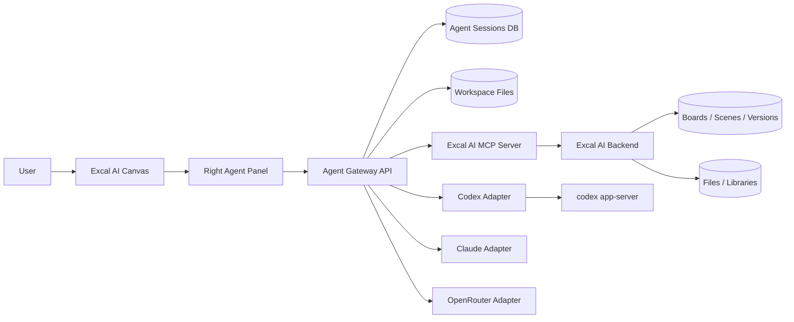

# Codexy Agent + Excal AI Integration Thesis

Date: 2026-06-20

## Executive Verdict

Yes, this direction is possible.

Your `codexy` and `server/codexy-pilot` are already using the correct OpenAI/Codex primitive for a deep embedded coding-agent product: `codex app-server --stdio`.

But the current code is still a pilot, not production-safe:

- no real web auth around the Codexy UI/API
- no durable app-level conversation database
- no Excalidraw canvas/MCP integration yet
- EC2 pilot mounts Docker socket, which is powerful and risky
- per-user Codex auth exists structurally, but must be protected like passwords
- provider switching is possible architecturally, but not automatically equal across Codex, Claude, and OpenRouter

Best product direction:

```text
Excal AI canvas
  -> right-side Agent Panel
  -> Agent Gateway backend
  -> provider adapters: Codex / Claude Code / OpenRouter / local
  -> shared MCP/tool layer
  -> workspace files + canvas scene + audit + approvals
```

Do not make the browser talk directly to Codex, Claude, or model keys. Keep that behind your backend.

## What You Have Locally

### `codexy`

Path: `C:\Users\adars\OneDrive\Desktop\excal-ai\codexy`

Local browser harness for Codex.

Validated files:

- `server.mjs`
- `public/app.js`
- `README.md`
- `AGENTS.md`
- generated apps under `apps/<run-folder>/`

Runtime shape:

```text
Browser UI
  -> /api/auth/status
  -> /api/auth/device/start
  -> /api/runs
  -> SSE /api/runs/:id/events
  -> Node server
  -> codex app-server --stdio
  -> Codex thread/turn
  -> generated files in apps/<run-folder>
```

Strong parts:

- uses official-style app-server JSON-RPC
- supports ChatGPT device auth through `codex login --device-auth`
- creates isolated app folders per prompt
- starts Codex with `workspace-write`
- limits writable roots to the generated app folder
- disables network access by default
- streams assistant deltas and Codex events to browser via SSE

Weak parts:

- no durable DB
- no saved history UI
- no resume/list archived threads
- no preview server for generated app output
- no proper approval bridge
- `approvalPolicy: "never"` means blocked operations fail instead of asking user
- single local user model
- not integrated with Excalidraw scene state

### `server/codexy-pilot`

Path: `C:\Users\adars\OneDrive\Desktop\excal-ai\server\codexy-pilot`

Hosted/EC2 pilot.

Validated files:

- `api/src/server.mjs`
- `api/public/app.js`
- `api/Dockerfile`
- `runner/Dockerfile`
- `docker-compose.yml`
- `README.md`

Runtime shape:

```text
Browser UI
  -> API container on 127.0.0.1:8787
  -> Docker runner container per Codex command
  -> mounted user auth: data/users/<userId>/.codex -> /root/.codex
  -> mounted projects: data/users/<userId>/projects -> /workspace
  -> codex app-server --stdio
```

Good design signal:

- per-user Codex auth folders
- per-user project folders
- Codex runs in short-lived Docker containers
- supports user-selected `model`, `effort`, and runtime profile
- keeps generated work inside `/workspace/<project>`
- still uses `networkAccess: false`

Big risk:

`docker-compose.yml` mounts:

```yaml
/var/run/docker.sock:/var/run/docker.sock
```

That makes the API container effectively able to control Docker on the host. Fine for a private pilot; not acceptable as-is for a public/multi-user SaaS.

Also: the API has no product auth. Anyone who can hit it can submit `userId`, start login, run Codex, and read streamed events.

## What OpenAI Docs Say This Uses

Official Codex docs/manual used:

- `https://developers.openai.com/codex/codex-manual.md`
- Codex App Server: `/codex/app-server.md`
- Codex SDK: `/codex/sdk.md`
- Authentication: `/codex/auth.md`
- MCP: `/codex/mcp.md`
- Sandboxing: `/codex/concepts/sandboxing.md`
- AGENTS.md: `/codex/guides/agents-md.md`
- Hooks: `/codex/hooks.md`
- Subagents: `/codex/subagents.md`
- Custom model providers: `/codex/config-advanced`

Key official facts:

- `codex app-server` is intended for deep product integrations with authentication, history, approvals, and streamed agent events.
- It speaks JSON-RPC over stdio by default.
- It has thread and turn primitives.
- The SDK is better for automation/CI, but app-server is better for rich interactive clients.
- MCP connects Codex to tools/resources/prompts.
- Codex supports STDIO MCP and Streamable HTTP MCP.
- Codex auth can be ChatGPT subscription login or API key.
- ChatGPT login caches credentials under `~/.codex/auth.json` or OS credential store.
- Device auth exists for remote/headless login.
- Sandbox modes include `read-only`, `workspace-write`, and full access.
- Custom model providers exist via `config.toml`.
- Hooks and subagents are customization layers, not a replacement for your product backend.

## Is Codexy The Correct Way?

For your vision: yes, mostly.

Use `codex app-server` when you want:

- right-side native chat in Excal AI
- streamed progress/events
- file edits
- shell/tool execution
- workspace-specific conversation
- approvals
- user-specific Codex login
- deep integration with your app

Use Codex SDK when you want:

- background jobs
- CI/review automation
- scheduled maintenance tasks
- non-interactive backend workflows

Use MCP when you want:

- Codex to understand Excal AI workspaces/boards
- safe canvas read/write tools
- library search/import tools
- Jira/GitHub/internal task tools
- stable provider-agnostic tool layer

## Important Boundary: Can You Reuse ChatGPT Subscription?

Possible for private/user-specific Codex usage, because Codex supports ChatGPT login and device auth.

But do not treat one ChatGPT/Codex login as a shared SaaS engine for all users.

Correct model:

```text
Each user
  -> logs into Codex/OpenAI where needed
  -> auth stored per user
  -> runs scoped to their workspace/projects
```

For your own commercial/cloud product, you must confirm licensing/terms separately. The docs establish technical auth paths, not blanket redistribution rights.

## Can Codex Be Customized Enough?

Yes, but in layers:

| Need | Codex surface |
| --- | --- |
| repo/project rules | `AGENTS.md` |
| reusable workflow | Skills |
| external tools/context | MCP |
| lifecycle policy/logging | Hooks |
| specialized workers | Subagents |
| model/provider routing | `config.toml` model providers |
| rich embedded UI | `codex app-server` |

What Codex does not give you automatically:

- your Excal AI account system
- workspace database
- canvas approval UX
- billing
- provider-neutral history
- provider-neutral tool schema
- browser-native Excal panel

You build those.

## Excal AI Integration Architecture

Recommended target:



Agent panel responsibilities:

- chat UI
- selected canvas/frame context
- user approval prompts
- diff preview
- tool activity timeline
- provider/model selector
- session history

Agent Gateway responsibilities:

- provider adapter selection
- per-user auth mapping
- prompt/context packing
- file workspace mounting
- stream normalization
- event persistence
- audit logs
- approval routing
- MCP client/tool registry

Excal MCP server responsibilities:

- `boards.list`
- `board.get_scene`
- `board.query_elements`
- `board.propose_diff`
- `board.apply_diff`
- `library.search`
- `library.insert`
- `frame.to_prd`
- `frame.to_prototype`
- `tasks.create`
- `export.scene`

## How Canvas Context Should Flow

Do not dump the whole scene every time.

Better context layers:

```text
User selection
  -> selected elements / frame
  -> nearby connected arrows/text
  -> board metadata
  -> recent version summary
  -> file/library refs
  -> user prompt
```

For large boards:

- summarize old regions
- include only selected frame in full detail
- expose rest through MCP resources/tools
- let the agent query more when needed

## Provider Switching Thesis

You can build:

```text
Codex | Claude Code | OpenRouter | Local
```

But the common layer must be yours.

Provider-neutral contract:

```text
AgentProvider.startSession()
AgentProvider.sendTurn()
AgentProvider.streamEvents()
AgentProvider.cancel()
AgentProvider.resume()
AgentProvider.listTools()
AgentProvider.requestApproval()
```

Codex adapter:

- backed by `codex app-server`
- strongest local code/file/sandbox story
- best fit for coding and repo work

Claude Code adapter:

- likely separate CLI/process adapter
- needs its own auth and sandbox handling
- tool parity must be proven later from Anthropic docs/code

OpenRouter adapter:

- good for model choice
- weaker if used only as chat completions
- needs your own tool executor, patch applier, sandbox, approvals, history

Conclusion:

Use Codex as the first premium adapter. Design the gateway so providers are swappable, but do not assume equal behavior.

## EC2: Good Idea Or Not?

EC2 is the right class of host for the agent runner.

Vercel is not enough for the runner because you need:

- long-lived streams
- spawned processes
- Docker/container isolation
- per-user workspaces
- Codex CLI/app-server
- filesystem persistence
- sometimes package installs/builds

Good split:

```text
Vercel
  -> Excal AI frontend

EC2 / ECS / Fly / Kubernetes
  -> Agent Gateway
  -> Runner containers
  -> MCP server
  -> preview proxy
```

Production hardening needed:

- real auth before every API call
- map authenticated user -> internal user id, never trust raw `userId`
- remove direct Docker socket exposure or isolate it heavily
- per-run CPU/memory/time limits
- rootless containers or stronger sandbox such as Firecracker/gVisor if public
- encrypted credential storage
- no raw `auth.json` leakage
- run/event database
- audit logs
- approval queue
- rate limits
- network egress policy
- project cleanup/retention

## Surprise Findings

### 1. You Already Used The Right Low-Level Protocol

`codexy` is not a random wrapper. It mirrors the official app-server model:

```text
initialize -> initialized -> thread/start -> turn/start -> stream notifications
```

That is the correct base for a native Excal AI agent panel.

### 2. The EC2 Pilot Is Multi-User-Shaped, But Not Multi-User-Safe

The folder structure is right:

```text
data/users/<userId>/.codex
data/users/<userId>/projects
```

But `userId` is user-supplied and unauthenticated today. Product auth must own identity.

### 3. The Runtime Profile Says Fullstack, But Network Is Still Off

`static`, `node`, and `fullstack` profiles exist, but `networkAccess: false` is always passed.

So package installs/API calls will fail unless you add a controlled approval/network mode.

### 4. `approvalPolicy: never` Is Fine For Demos, Bad For Product UX

For a user-facing agent, approval should surface in the Excal AI panel:

```text
Agent requests permission
  -> backend creates approval
  -> UI shows exact command/tool/action
  -> user approves/denies
  -> agent continues
```

### 5. App-Server Schemas Should Be Generated And Versioned

Official docs expose:

```bash
codex app-server generate-ts --out ./schemas
codex app-server generate-json-schema --out ./schemas
```

Use this. It prevents protocol drift as Codex updates.

### 6. Your Best Moat Is Not “AI Chat”

The moat is:

```text
Canvas semantics + workspace memory + file control + approval UI + libraries + agent tools
```

The model is replaceable. The Excal AI operating layer is the product.

### 7. Library Integration Is A Real Lead

Expose libraries as MCP resources/tools:

```text
library.search("AWS architecture")
library.preview(id)
library.insert(id, boardId, x, y)
library.save_from_selection(...)
```

That makes the agent useful inside a visual canvas, not just a code folder.

## Recommended Build Plan

### Phase 1: Make Codexy Product-Safe

- add real auth to Codexy Pilot API
- replace free-text `userId` with authenticated user id
- persist sessions/runs/events in DB
- generate and commit app-server schemas
- add run cancellation
- add approval bridge
- add preview proxy for generated apps
- add cleanup/retention

### Phase 2: Connect Excal AI Canvas

- add right-side Agent Panel in Excal AI
- send current board/frame/selection context to Agent Gateway
- stream agent events into the panel
- show proposed scene diffs before applying
- add audit log per board

### Phase 3: Build Excal AI MCP

Minimum useful tools:

- `boards.list`
- `board.get_scene`
- `board.propose_diff`
- `board.apply_diff`
- `library.search`
- `library.insert`

Important: write through backend/versioning, not direct browser mutation only.

### Phase 4: Add Provider Adapters

Start with:

```text
Codex adapter -> app-server
```

Then add:

```text
OpenRouter adapter -> custom agent runner + MCP tools
Claude adapter -> researched separately from Anthropic/Claude Code docs
```

### Phase 5: Turn Canvas Into A Work OS

Use agent tools for:

- diagram generation
- frame to prototype
- frame to PRD
- brainstorming clustering
- Jira/task creation
- library import
- code repo edits
- design review
- version comparison
- workspace memory

## Final Thesis

Your long-term idea is technically sound:

```text
Excal AI should become:
  infinite canvas
  + workspace/files
  + right-side agent harness
  + MCP/tool layer
  + provider adapters
  + user-specific persistent memory/history
```

Codex is the best first agent engine because its app-server already supports the kind of rich local tooling you want.

But the durable product should not be "Codex inside Excalidraw" only.

It should be:

```text
Excal AI Agent Gateway
  with Codex as provider #1
  MCP as the shared tool layer
  Excal workspace as source of truth
  canvas diff approval as the trust model
```

That keeps you free to add Claude, OpenRouter, local models, or future agents without rebuilding the canvas/product layer.

