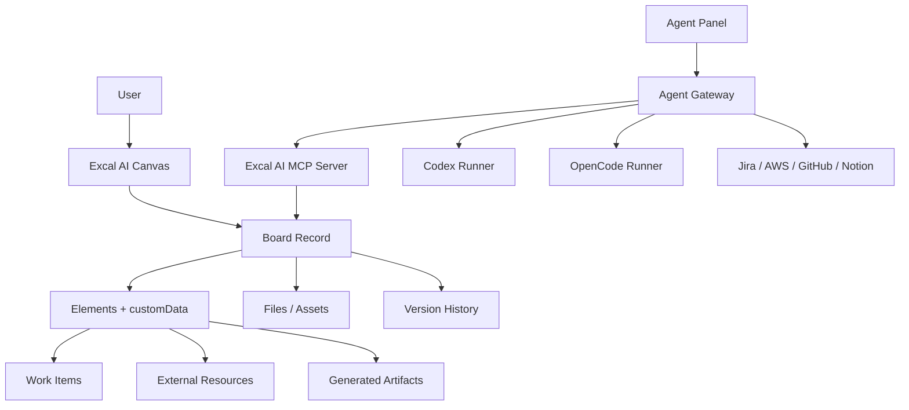
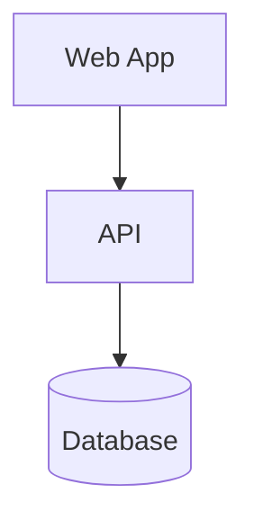
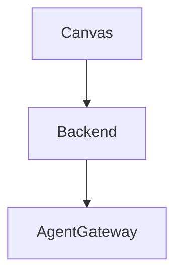

# Excal AI Feature Pathway From Product Notes

Date: 2026-06-27

## Purpose

This note turns the latest handwritten/product notes into an executable product pathway.

It does not assume every idea should be built immediately. It classifies each idea by:

- whether it fits the core product thesis
- whether the current Excalidraw fork already has useful primitives
- what backend/integration work is required
- what should be delayed until the platform spine exists

## Current Product Thesis

Excal AI should not be just an Excalidraw rebrand, a drawing app, or a generic AI chat panel.

The stronger thesis is:

```text
Canvas-first work system
  + AI/agent execution
  + structured project objects
  + cloud/code/infrastructure context
  + visual documentation
  + multi-view output
```

The canvas is the primary interaction surface. The backend stores the durable meaning. Agents and MCPs perform controlled actions against that backend.

## Core Product Rule

Every large feature must attach to at least one of these primitives:

1. `Board`
2. `Frame`
3. `Canvas element`
4. `Work item`
5. `External resource`
6. `Generated artifact`
7. `Agent run`
8. `Automation rule`
9. `DRAW.md visual document`

If a feature cannot attach to one of these, it should probably be an integration, plugin, or later experiment rather than core product work.

## Why This Matters

The danger is not having too many ideas. The danger is building them as unrelated modules.

The correct approach is:

```text
visual object on canvas
  -> structured metadata
  -> backend record
  -> AI/MCP tools
  -> alternate views
  -> automation/action
```

That lets Jira, Kanban, AWS, reminders, libraries, prototypes, presentations, and repo diagrams share one product model instead of becoming separate products stitched together.

## Validated Current Foundations

### Excalidraw Fork Gives Us

Evidence from existing research and code:

- `packages/excalidraw` exposes the core React editor.
- `excalidraw-app` is the hosted app shell.
- `initialData` can load a saved scene.
- `onChange` can persist elements, app state, and files.
- `excalidrawAPI.updateScene()` can apply controlled changes.
- `excalidrawAPI.getSceneElementsIncludingDeleted()`, `getAppState()`, and `getFiles()` can extract canvas state.
- `customData` on elements is a major product hook for linking objects to backend records.
- Sidebar, Main Menu, Footer, Welcome Screen, and embeddables are viable UI extension points.
- AI frontend hooks already exist for text-to-diagram and diagram-to-code.
- Mermaid conversion is available and should be used before inventing direct JSON generation.
- Collaboration and share-link clients exist, but production envs still point upstream unless replaced.

### Supporting Repos Give Us

- `drawsy-ai-store`: owned share-link backend using Cloudflare R2.
- `drawsy-ai-wss`: owned Socket.IO collaboration server base.
- `drawsy-ai-r2`: R2 presigned URL signer for files/blobs.
- `drawsy-ai-libraries`: library catalog/content base.
- `codexy`: local Codex app-server harness.
- `server/codexy-pilot`: hosted Codex runner pilot.
- `server/opencode-pilot`: hosted OpenCode runner pilot.

### Still Missing

- real account/session/auth system
- workspace/project/board database
- cloud document CRUD
- version history
- task/work-item model
- comments/polls/reminders database
- production AI backend
- Agent Gateway
- MCP server connected to Excal AI backend
- production-safe sandboxed runners
- integration credential storage
- billing/quota/subscription if commercialized

## Product Spine

Before building broad features, build this spine.



The spine is what keeps the product coherent.

## Data Model Direction

### Board

Represents a durable canvas document.

Minimum fields:

- `id`
- `workspaceId`
- `title`
- `sceneVersion`
- `elementsJson`
- `appStateJson`
- `filesManifest`
- `createdBy`
- `updatedBy`
- `createdAt`
- `updatedAt`

### Element Metadata

Use Excalidraw `customData` rather than changing upstream element schema first.

Example:

```json
{
  "drawsy": {
    "objectType": "task",
    "recordId": "task_123",
    "source": "ai_generated",
    "linkedResources": ["jira:ABC-12", "aws:arn:..."]
  }
}
```

### Work Item

Represents task/todo/reminder/Jira-like tracked work.

Minimum fields:

- `id`
- `workspaceId`
- `boardId`
- `elementId`
- `title`
- `description`
- `status`
- `ownerId`
- `dueAt`
- `priority`
- `source`
- `externalRefs`

### External Resource

Represents AWS ARN, GitHub repo, Jira issue, Notion page, web app preview, video, stock symbol, or any connected object.

Minimum fields:

- `id`
- `workspaceId`
- `provider`
- `resourceType`
- `externalId`
- `displayName`
- `metadataJson`
- `lastSyncedAt`
- `permissions`

### Agent Run

Represents a Codex/OpenCode/Claude/local agent session.

Minimum fields:

- `id`
- `workspaceId`
- `boardId`
- `provider`
- `model`
- `prompt`
- `contextScope`
- `status`
- `events`
- `proposedDiffs`
- `approvals`
- `artifacts`

## Feature Classification

### 1. Tooling And Project Management

#### IDE Tools Add Up

Interpretation:

Users lose time across many IDE tools, code agents, preview servers, project setup, issue trackers, docs, and deployment steps.

Valid product angle:

- Excal AI becomes a visual control plane for development work.
- The canvas can represent repos, services, tickets, tasks, environments, and prototypes.
- Agent runners execute coding tasks through Codex/OpenCode.
- The board stores project intent and architecture visually.

Required primitives:

- Agent Gateway
- workspace files
- repo/project records
- preview artifacts
- task records
- audit logs

MVP:

- select a frame and send it to Codex/OpenCode as a build task
- stream agent output in a right-side panel
- save generated app under a project artifact
- show instant preview link on canvas

#### Animations

Valid product angle:

- useful for presentations, explainers, onboarding flows, architecture walkthroughs, and prototype demos
- less urgent than persistent board/work/task foundations

Possible implementation path:

- Phase 1: frame sequence presentation mode
- Phase 2: element transition presets between frames
- Phase 3: export to video/GIF
- Phase 4: AI-generated walkthrough narration

Risk:

- can become expensive UI polish before core value is proven

Recommendation:

- delay advanced animation until presentation mode and frame sequencing exist

#### Jira

Valid product angle:

- very strong fit
- research already says Excal AI should turn visual thinking into tracking

MVP:

- selected notes/shapes -> task drafts
- task drafts -> internal task model
- internal tasks -> Jira issue dry-run
- user approves -> Jira issues created
- Jira IDs saved into element `customData`

Required integrations:

- OAuth/API token storage
- Jira project mapping
- issue type mapping
- status mapping
- approval UI
- sync worker

Important rule:

- do not make Jira the source of truth for the canvas
- Excal AI owns the visual/work model and syncs outward

#### Notion / Kanban

Valid product angle:

- Kanban is core because it is an alternate view of work items
- Notion is an integration or inspiration, not something to clone first

MVP:

- canvas objects linked to `WorkItem`
- board/list/kanban views over the same records
- status changes reflected back on canvas cards

Notion-style later features:

- docs linked to frames
- generated meeting notes
- specs from frames
- database-like views

### 2. Media And Research Capabilities

#### Research

Valid product angle:

- strong fit if research output lands on the canvas as structured cards, sources, claims, and summaries

MVP:

- ask agent to research a topic
- output source cards grouped by theme
- each card stores URL, title, quote, date, confidence, and summary
- user can convert source clusters into PRD/spec/tasks

Required:

- web search/fetch provider
- citations model
- source cards
- workspace memory
- permissions around external browsing

Risk:

- generic research chat is not differentiated

Differentiator:

- research becomes spatial evidence on the canvas, then turns into execution artifacts

#### Integrate Video

Valid product angle:

- useful for design reviews, user interviews, product demos, meeting recordings, walkthroughs, and generated presentations

MVP:

- embed video URL as canvas object
- transcript extraction
- timestamped notes linked to frames/elements
- AI summary/action items from transcript

Later:

- clip generation
- storyboard from frames
- presentation recording
- video export of animated board walkthrough

Security:

- embeddables need strict URL validation
- private videos need provider auth

#### Integrate Libraries With AI

Valid product angle:

- very strong because Excalidraw already has library primitives and this fork has Drawsy library catalog work

MVP:

- AI searches library catalog by prompt
- previews matching packs
- inserts selected library item onto canvas
- saves selected objects as a new library pack

MCP tools:

- `library.search`
- `library.preview`
- `library.insert`
- `library.save_from_selection`

Product advantage:

- agents become visually useful, not just text/code tools

### 3. Code And Presentation Ecosystem

#### IaC

Valid product angle:

- strong if paired with cloud resource reading and visual diagrams

MVP:

- selected architecture diagram -> Terraform/CDK skeleton proposal
- user reviews generated files in agent panel
- generated IaC links back to canvas elements

Required:

- repo workspace
- agent runner
- file diff approval
- IaC templates
- cloud provider schemas

Safety:

- never apply infrastructure changes directly in MVP
- generate pull-request-ready files first
- require explicit approval for deploy/apply workflows later

#### Vibe Code

Interpretation:

Natural-language and canvas-driven prototype generation.

Valid product angle:

- strong fit with Codex/OpenCode pilots

MVP:

- select a frame/sketch/spec
- send to Codex or OpenCode runner
- generate web app prototype
- show instant preview link back on canvas
- store generated files/artifact under workspace

Required:

- Agent Gateway
- preview proxy
- artifact storage
- run history
- approval model
- project cleanup/retention

Do not ship publicly until:

- runner auth is real
- user identity is backend-controlled, not free-text `userId`
- Docker socket risk is removed or strongly isolated
- credentials are encrypted

#### Presentation

Valid product angle:

- strong because frames already provide a natural structure

MVP:

- frame ordering
- present mode
- speaker notes per frame
- AI summary per frame
- export to PDF/slides

Later:

- animation between frames
- AI narration
- recorded walkthrough
- interactive presentation links

#### Canva Slides

Valid product angle:

- useful as output, not as a full Canva clone

MVP:

- export selected frames to slide deck format
- themed title/section/content layouts
- AI turns messy frames into polished slides

Possible integrations:

- Google Slides export
- PowerPoint export
- Canva-style template gallery later

Product boundary:

- Excal AI should generate visual decks from work already on canvas
- it should not start as a general-purpose design suite

### 4. Annotation, Editing, Image Generation

#### Annotate

Valid product angle:

- core for reviews, research, diagrams, videos, generated prototypes, screenshots, and cloud maps

MVP:

- comment/annotation element type via existing shapes/text + `customData`
- anchor annotation to element/frame/resource
- resolve/open status
- mention/owner later

#### Editing

Valid product angle:

- broad term; needs clear split

Types:

- canvas editing: already core
- AI editing: propose/apply scene diffs
- media editing: later
- code editing: via agent runners
- document editing: workspace docs/specs later

Rule:

- AI edits must be proposed as diffs first, not silently applied

#### Generate Image

Valid product angle:

- useful for moodboards, icons, storyboards, UI mockups, marketing, presentation visuals

MVP:

- prompt -> generated image -> inserted as file element
- selected frame -> generate visual variation
- keep provenance in `customData`

Required:

- image model backend
- asset storage
- cost/quota tracking
- content safety policy

### 5. Productivity And Integrations

#### Stocks

Valid only as an external data widget, not a core product direction.

Possible valid uses:

- investor decks
- market research boards
- finance dashboards
- company/product analysis

MVP if needed later:

- stock symbol resource card
- price/chart snapshot
- source and timestamp
- no trading/execution

Recommendation:

- do not prioritize unless finance/research users become a target segment

#### Reminders

Valid product angle:

- useful if tied to work items, frames, reviews, follow-ups, and automation rules

MVP:

- reminder on task/card/frame
- due date badge on canvas
- reminder list view

Later:

- calendar integration
- Slack/email notifications

#### Todos

Valid product angle:

- core as the simplest `WorkItem`

MVP:

- selected text/sticky notes -> todos
- todo status badge on element
- list/kanban view
- sync to Jira only when needed

#### MCPs Connect

Valid product angle:

- core for agent extensibility

Important distinction:

- MCP is not the product UI by itself
- MCP is the tool protocol behind agents and integrations

MVP:

- Excal AI MCP server with board read/propose/apply tools
- product settings page to connect external MCP servers later
- allowlist permissions per workspace

Required tools:

- `boards.list`
- `board.get_scene`
- `board.query_elements`
- `board.propose_diff`
- `board.apply_diff`
- `library.search`
- `tasks.create`

#### Automation Flows

Valid product angle:

- strong if powered by the shared object/work model

MVP:

- trigger: task moved to Done
- action: update summary frame
- trigger: frame marked Planning
- action: propose tasks
- trigger: AWS resource sync changes
- action: add warning card

Required:

- event log
- rules engine
- approval gates
- integration permissions

Do not start with a full Zapier clone.

Start with canvas-native automations.

### 6. Infrastructure And Core Canvas Features

#### AWS ARN Resource Read

User note:

The AWS ARN will be provided by the user, and Excal AI can show their AWS.

Validated product angle:

- very strong if handled as read-only infrastructure visualization first

Correct security model:

- user should not paste long-lived AWS root keys
- prefer AssumeRole / OIDC / scoped read-only role
- ARN alone identifies a resource but does not grant access
- backend needs authenticated AWS credentials/role to call AWS APIs
- every cloud action needs audit logging

MVP:

- user enters ARN
- app validates ARN format
- user connects AWS read-only role
- backend identifies service/resource type
- backend fetches metadata and relationships
- canvas renders resource card/group
- AI explains what the resource is, dependencies, risk, and cost hints

Resource examples:

- Lambda ARN -> function node, runtime, triggers, IAM role, logs
- S3 bucket ARN -> bucket node, region, encryption, public access flags
- ECS service ARN -> cluster/service/task definitions/load balancer links
- RDS ARN -> database node, subnet/security group/backup posture
- IAM role ARN -> trust policy/attached policies risk summary

Later:

- multi-resource graph discovery
- generate IaC from discovered resources
- drift detection
- cost optimization hints
- security posture cards

Forbidden early behavior:

- no write/deploy/delete cloud actions before strong auth, approvals, and audit

#### Grouping Of Canvas

User note references groups G1, G2, G3.

Valid product angle:

- extremely important
- grouping is how Excal AI can transform messy canvas areas into structured workspaces

Needed concepts:

- native Excalidraw groups
- frames
- inferred clusters by proximity/arrows/colors
- user-defined semantic groups
- AI-generated group labels

MVP:

- select multiple elements -> create semantic group
- semantic group stores `customData.drawsy.groupId`
- group can become task cluster, feature, service, meeting, sprint, flow, or research cluster
- group summary appears in sidebar

AI actions:

- summarize group
- convert group to tasks
- convert group to spec
- clean layout
- generate diagram from group
- create presentation slide from group

### 7. Application And Sharing Updates

#### Release Notes

Valid product angle:

- useful if tied to app/prototype/project changes

MVP:

- agent summarizes changes from tasks/commits/frames
- output release notes as a canvas/doc artifact
- optional templates for App Store and Play Store

Required data:

- linked tasks
- linked commits/PRs
- version number
- target platform

Later:

- App Store / Play Store metadata generation
- changelog automation
- screenshot generation from prototype

#### Polls

Valid product angle:

- useful for workshops, prioritization, design reviews, and team decisions

MVP:

- create poll card on canvas
- options linked to elements/frames
- votes stored in backend
- results visualized on canvas

Later:

- anonymous voting
- weighted voting
- decision log
- convert winning option to task/spec

#### Web Application

Interpretation:

- cloud-generated or user-authored web apps/prototypes as artifacts

Valid product angle:

- strong with Codex/OpenCode and instant preview

MVP:

- frame/spec -> generated web app
- preview URL attached to frame
- code artifact stored in workspace
- regenerate/apply changes through approval

#### Instant Preview Sharing Link

Valid product angle:

- strong and near-term for prototype workflows

MVP:

- generated prototype gets preview URL
- preview card inserted on canvas
- share link can be permissioned or public-token based

Required:

- preview proxy or static hosting
- artifact lifecycle
- access control
- expiration policy
- logs

## DRAW.md Concept

### One-Line Definition

`DRAW.md` is a repo/project visual documentation file: like `README.md` explains a project in text, `DRAW.md` explains it as diagrams, architecture maps, flows, and visual execution context.

### Why It Is A Serious Idea

Most repos have text docs that go stale. Architecture diagrams often live in images, Miro boards, Lucidchart files, or slide decks disconnected from code.

`DRAW.md` can become a file-based convention for living visual documentation.

The product value is not just rendering Mermaid. It is connecting diagrams to code, infrastructure, tasks, agents, and workspace memory.

### What DRAW.md Should Contain

Minimum useful format:

````markdown
# Project Visual Map

## System Overview



## Services

- web: frontend app
- api: backend service
- db: persistence

## Architecture Notes

- API owns auth and workspace records.
- Object storage holds uploads and generated assets.

## Excal AI Metadata

```json
{
  "version": 1,
  "source": "drawsy",
  "boards": [
    {
      "id": "board_architecture",
      "title": "Architecture"
    }
  ]
}
```
````

### Better Long-Term Format

The first version should be Markdown-compatible so GitHub renders it enough and agents can edit it safely.

Later, Excal AI can support richer frontmatter:

````markdown
---
draw: 1
project: excal-ai
defaultView: architecture
generatedBy: drawsy
updatedAt: 2026-06-27
---

# Architecture



```drawsy
{
  "views": [
    {
      "id": "architecture",
      "type": "mermaid",
      "source": "section:Architecture"
    }
  ],
  "links": [
    {
      "node": "Backend",
      "path": "server/api"
    }
  ]
}
```
````

### DRAW.md Product Behavior

In Excal AI:

1. User opens repo/project.
2. Excal AI detects `DRAW.md`.
3. App renders diagrams as editable canvas frames.
4. User edits visually.
5. App writes safe Markdown/Mermaid changes back to `DRAW.md`.
6. Agent can update `DRAW.md` after code/IaC changes.
7. Pull requests can include visual architecture diffs.

### DRAW.md Agent Tools

Potential MCP tools:

- `drawmd.read`
- `drawmd.parse`
- `drawmd.render_to_scene`
- `drawmd.propose_update`
- `drawmd.apply_update`
- `drawmd.link_code_symbol`
- `drawmd.generate_from_repo`
- `drawmd.generate_from_iac`
- `drawmd.check_staleness`

### DRAW.md Differentiation

The differentiator is not file extension novelty.

The differentiator is:

```text
repo reality
  -> visual architecture
  -> editable canvas
  -> agent-maintained docs
  -> code/IaC/task links
```

### DRAW.md MVP

MVP should be deliberately small:

1. Support `DRAW.md` with Mermaid blocks.
2. Render Mermaid blocks into Excalidraw elements.
3. Allow visual preview in Excal AI.
4. Let agent propose updates to Mermaid/text.
5. Commit changes through Codex/OpenCode runner.

Do not invent a complex proprietary format first.

### DRAW.md Later

- visual diff in pull requests
- staleness detection against repo files
- architecture ownership annotations
- links to AWS ARNs/resources
- links to Jira tickets
- links to generated prototypes
- automatic service maps from IaC
- export to README image, SVG, PDF, or docs site

## Feature Dependencies

### Must Exist First

These are platform foundations:

1. Workspace/account backend
2. Board save/load/versioning
3. File/blob storage
4. Element `customData` conventions
5. Work item model
6. Agent Gateway
7. Scene diff proposal/apply model
8. Approval and audit log
9. Integration credential storage

### Can Build In Parallel

- Drawsy library AI search/insert
- local `DRAW.md` rendering spike
- Codex/OpenCode prototype generation spike
- owned share/collab production env migration
- semantic grouping UI

### Must Wait

- cloud write/deploy automation
- advanced animations
- full Canva-like slide builder
- general stock dashboards
- public multi-user agent runner
- marketplace of external MCPs

## Recommended Roadmap

### Phase 0: Product Spine Decisions

Goal:

Decide the core model before building features.

Deliverables:

- `Board` schema
- `WorkItem` schema
- `ExternalResource` schema
- `AgentRun` schema
- `SceneDiff` schema
- `customData.drawsy` convention
- approval/audit rules

Done when:

- a canvas element can be linked to a backend record without changing Excalidraw element schema
- a proposed AI edit can be stored and reviewed before applying

### Phase 1: Owned Platform Baseline

Goal:

Stop depending on upstream production infrastructure where owned services already exist or are planned.

Deliverables:

- production envs for `drawsy-ai-store`
- production envs for `drawsy-ai-wss`
- owned Firebase or chosen scene persistence
- R2 signer production hardening
- Drawsy library URL/backend plan
- analytics/telemetry decision
- storage/cookie/local key ownership cleanup

Done when:

- share links work on owned backend
- collaboration works on owned WSS
- files persist on owned storage
- no production app path unintentionally sends core data to upstream Excalidraw services

### Phase 2: Canvas To Work

Goal:

Make Excal AI meaningfully different from plain Excalidraw.

Deliverables:

- semantic groups
- canvas-to-task
- canvas-to-spec
- frame summary panel
- work item sidebar
- list/kanban view over same work items
- Jira dry-run export

Done when:

- selected canvas content can become tracked work
- kanban/list/canvas stay linked to the same records
- Jira issues can be created only after approval

### Phase 3: Agent Panel And Prototype Generation

Goal:

Connect Codex/OpenCode runners to the canvas through a product-safe gateway.

Deliverables:

- right-side Agent Panel
- Agent Gateway MVP
- Codex adapter
- OpenCode adapter behind same internal interface
- streamed events
- run history
- file diff approval
- instant preview link artifact

Done when:

- a frame/spec can generate a prototype
- preview link appears on canvas
- generated code/files are stored as workspace artifacts
- all risky actions require approval

### Phase 4: DRAW.md MVP

Goal:

Make visual repo documentation a concrete workflow.

Deliverables:

- detect `DRAW.md`
- parse Markdown/Mermaid
- render diagrams into canvas
- allow agent-proposed Mermaid updates
- commit updates through runner

Done when:

- a repo can include `DRAW.md`
- Excal AI renders it visually
- agent can update it after a code/IaC change
- changes are reviewable in Git

### Phase 5: Cloud And IaC Visualization

Goal:

Turn cloud resources into readable, actionable canvas maps.

Deliverables:

- ARN parser
- AWS read-only connection flow
- resource cards
- relationship graph for common services
- risk/cost/security summaries
- IaC generation draft flow

Done when:

- user can provide an ARN and connected read-only access
- Excal AI visualizes the resource and key relationships
- AI can propose IaC/docs/tasks without applying cloud changes

### Phase 6: Research, Media, Presentation

Goal:

Expand output modes after core work/agent/cloud loops exist.

Deliverables:

- research source cards
- video transcript cards
- presentation frame sequence
- slide export
- generated image insertion
- basic animation between frames

Done when:

- research/media/presentation outputs are linked to board objects and work items
- they are not separate isolated features

### Phase 7: Automations And Integrations

Goal:

Let users define repeatable workflows across canvas/work/cloud/code.

Deliverables:

- event log
- simple rule builder
- approved actions
- reminders/todos notifications
- poll-to-decision flow
- integration sync jobs

Done when:

- users can define safe automation rules around canvas/work events
- external writes always require configured permissions and audit logs

## First Three Build Bets

### Bet 1: Canvas To Work Items

Why:

This is the clearest Miro/Jira wedge.

Build:

- select notes/shapes
- AI clusters/summarizes
- create tasks/spec
- show kanban/list
- link records through `customData`

### Bet 2: Agent-Generated Prototype From Frame

Why:

This uses the Codex/OpenCode work already underway and makes the canvas feel executable.

Build:

- frame/spec -> agent run
- generated files -> artifact
- preview URL -> canvas card
- diff/approval -> trust model

### Bet 3: DRAW.md MVP

Why:

This can become a unique category-defining convention if kept simple and Git-native.

Build:

- Markdown + Mermaid first
- render visually
- update through agents
- link to repo files and future IaC/cloud resources

## Things To Be Careful About

### Do Not Overbuild Account/Workspace Before A Killer Loop

Auth/workspace is necessary, but the product must quickly prove a loop users feel:

```text
messy canvas -> structured work -> agent action -> visible output
```

### Do Not Make Agents Directly Mutate Boards Without Review

Use proposed diffs and approvals.

### Do Not Treat ARN As Permission

An ARN identifies a resource. It does not authorize reads.

Need scoped AWS access.

### Do Not Clone Canva, Jira, Notion, Or Miro Feature-For-Feature

Borrow the useful model, then route it through Excal AI's canvas/work/agent spine.

### Do Not Build A General MCP Marketplace First

Start with Excal AI MCP tools that make the canvas useful to agents.

External MCP connection can come later.

## Clear Product Positioning

Possible positioning:

```text
Excal AI turns visual thinking into executable work.
```

Expanded:

```text
Draw, group, and explain ideas on a canvas.
Turn them into tasks, specs, prototypes, cloud maps, diagrams, and visual docs.
Use Codex/OpenCode/MCP agents to execute changes with reviewable diffs.
```

## Final Pathway

The valid direction is not to make a whiteboard with random integrations.

The valid direction is to make a canvas-native operating layer where:

- visual groups become structured objects
- structured objects become tasks/specs/resources/artifacts
- agents act through approved diffs
- integrations are connected through MCP/backend tools
- generated outputs return to the canvas
- `DRAW.md` makes visual architecture a repo-native convention

That is the pathway worth pursuing.
