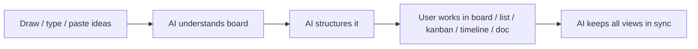
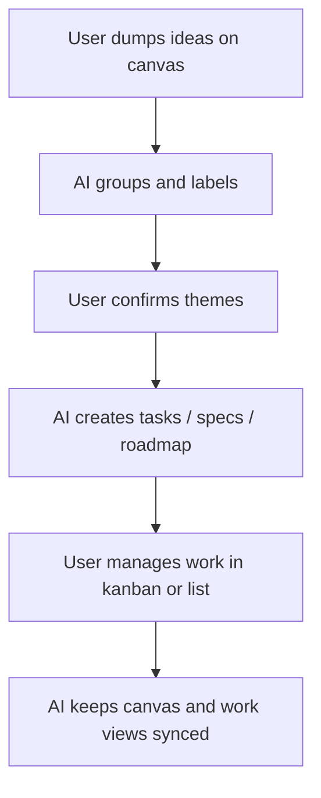

# Excali AI: What To Build From Miro + Jira

This is the direct product takeaway after exploring your live Miro and Jira workspaces on 2026-06-18.

## Core Insight

Miro wins at `thinking`.

Jira wins at `tracking`.

Excali AI should win at `turning thinking into tracking without leaving the canvas`.

## Product Positioning

`Excalidraw + AI + work system`

Not just drawing.
Not just kanban.
Not just chat.

It should be:
- a thinking canvas
- a planning canvas
- a task system
- a lightweight spec system

## Very Simple Product Model

## What Excali AI Must Have

1. `Canvas -> Task`
Select notes/shapes and convert them into tasks.

2. `Canvas -> Spec`
Select a frame and ask AI to turn it into a brief, PRD, checklist, or feature spec.

3. `Canvas -> Flow`
Turn rough sketches into cleaner system diagrams, flows, and dependencies.

4. `One object, many views`
Same item should appear as:
- canvas card
- kanban item
- list row
- timeline item
- doc reference

5. `AI clustering`
Group messy notes into themes, epics, risks, decisions, and next steps.

6. `AI meeting output`
From a brainstorm board, generate:
- summary
- decisions
- action items
- owners
- follow-ups

7. `Frames as workspaces`
Each frame can act like:
- meeting room
- feature room
- sprint room
- team room

8. `Inline automation`
Examples:
- when item moves to done -> update summary
- when frame is marked planning -> generate tasks
- when notes are clustered -> propose roadmap

## Best Features To Build First

1. `AI select-and-transform`
User selects anything on canvas and gets actions like:
- make tasks
- make spec
- group ideas
- summarize
- create roadmap

2. `Synced kanban from canvas`
Board objects become live cards, not copied cards.

3. `Frame summary panel`
Every frame gets AI-generated:
- purpose
- key points
- open questions
- action items

4. `Idea to execution mode`
One click to convert brainstorm board into a project board.

5. `Visual dependency mapping`
AI reads arrows, grouping, proximity, and labels to infer dependencies.

## Features That Can Differentiate Excali AI

1. `Sketch-native AI`
Understand rough drawings, not only typed text.

2. `Spatial intelligence`
Use placement, grouping, arrows, frames, and color as meaning.

3. `Human stays on canvas`
Do not force users into forms too early.

4. `Soft structure`
Add structure only when useful, not at the start.

5. `Fast mode switching`
Brainstorm mode -> planning mode -> tracking mode -> presentation mode

## Suggested User Journey

## Practical Feature Buckets

### Bucket 1: Must build
- canvas-to-task
- canvas-to-spec
- AI clustering
- synced kanban
- frame summaries

### Bucket 2: Strong upgrades
- timeline from board
- dependency graph from arrows
- meeting summary and follow-ups
- automation rules
- doc generation from frames

### Bucket 3: Later
- release notes generation
- QA test case generation
- requirement-to-feature breakdown
- AI presentation mode

## What Not To Copy Blindly

### From Jira
- too many forms
- too much setup
- too many fields before work starts

### From Miro
- too much freedom without structure
- boards becoming messy forever
- weak execution follow-through

## Best One-Line Direction

`Make Excalidraw the place where messy visual thinking becomes organized execution with one AI step.`
