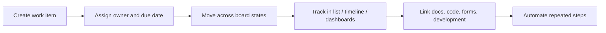
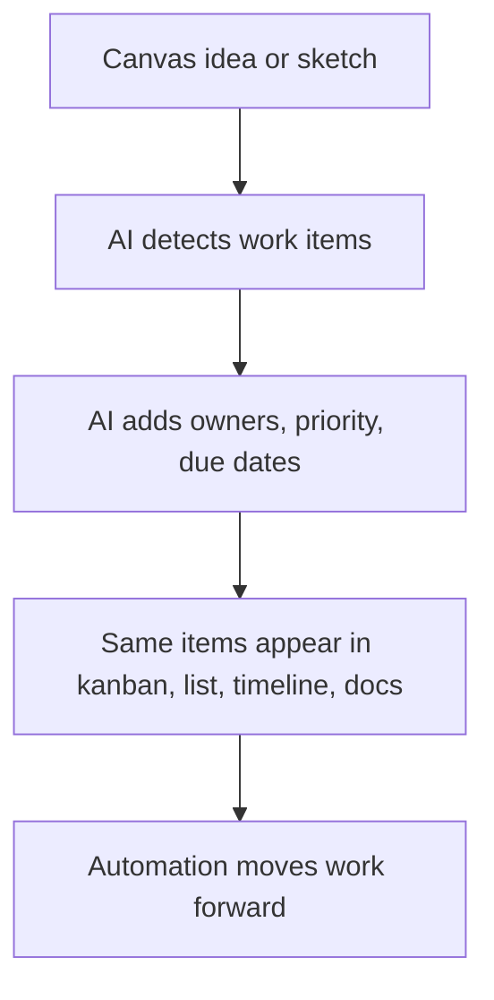

# Jira: Simple User View

Observed in your Jira workspace on 2026-06-18:
- Home area with `For you`, `Recent`, `Starred`
- Workspace-level items like `Plans`, `Spaces`, `Filters`, `Dashboards`, `Teams`, `Goals`, `Projects`
- Inside your project `My Software Team`: `Summary`, `List`, `Board`, `Code`, `Forms`, `Timeline`, `Docs`, `Development`
- Board flow with `To Do`, `In Progress`, `In Review`, `Done`
- Fast issue creation using `summary`, `type`, `due date`, `assignee`
- Project actions like `Automation`, `Share`, `Board insights`, `View settings`

## What Jira Is

Jira is a work tracking system.

People use it when work must move with status, owners, dates, and accountability.

## What Users Commonly Use It For

1. Tracking tasks, bugs, stories, and epics.
2. Running sprint boards or kanban boards.
3. Assigning work to people.
4. Planning deadlines and timelines.
5. Connecting product work with engineering work.
6. Collecting requests through forms.
7. Reporting progress through dashboards and filters.
8. Automating repetitive work.

## Main Things A User Feels In Jira

### 1. Structured work
Every item becomes a tracked work object.

### 2. Status-driven workflow
Work moves across states like:
- To Do
- In Progress
- In Review
- Done

### 3. Many views on the same work
From your project, the same work can appear in:
- Board
- List
- Timeline
- Docs
- Forms
- Development

### 4. Execution-first
Jira is less about free thinking and more about making sure work gets done.

## Simple User Flow

## Why People Like Jira

1. Clear ownership.
2. Clear progress.
3. Good for teams with repeated delivery work.
4. Multiple views on the same tasks.
5. Works well when planning and reporting matter.

## Where Jira Is Weak

1. Can feel heavy before work even starts.
2. Forms and fields slow down early thinking.
3. Less natural for brainstorming.
4. Visual ideation is weaker than Miro-style tools.

## What Excali AI Should Learn From Jira

1. Same underlying data should support many views.
2. Every task should have clear status and owner.
3. Board is not enough; list, timeline, docs also matter.
4. Automation is a core feature, not a bonus.
5. Intake matters: forms/requests should become tracked work fast.

## Best Ideas To Borrow

1. `One object, many views`
2. `Easy task creation on board`
3. `Timeline view from board items`
4. `Docs linked to work items`
5. `Automation rules on status changes`
6. `Filters and dashboards for reporting`

## Excali AI Opportunity

Jira is strong at:
- execution
- accountability
- planning
- reporting

Excali AI should beat it by doing one more thing:

`Let users think visually first, then generate structured project tracking from the canvas.`

## Excali AI Direction From Jira

