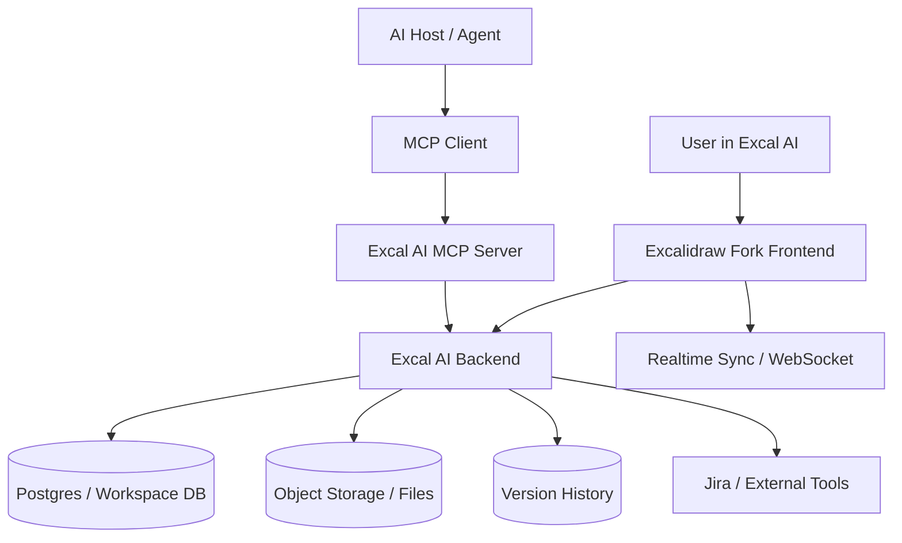

# MCP Integration Agent Task Plan

Date: 2026-06-20

## Executive Summary

- Yes, MCP can let an AI agent perform user tasks in Excal AI, but only if Excal AI exposes controlled backend tools/resources over an MCP server.
- MCP alone does not control the canvas. It is a protocol layer between an agent host and tools/resources that Excal AI must build.
- The best self-hosted pattern is: agent host -> MCP client -> Excal AI MCP server -> Excal AI backend -> workspace documents/storage -> Excalidraw frontend sync.
- The current fork has strong editor APIs for scene read/write, export/import, AI UI hooks, collaboration clients, and Firebase-based storage paths.
- The current fork does not include a full Plus/workspace/account/MCP product backend. That product layer must be built.
- MCP tools should operate on versioned scene diffs, not uncontrolled full-scene rewrites.
- High-risk actions need approvals: deletes, bulk changes, embedded-scene export, Jira issue creation, version restore, and external sync.
- The first useful MVP is a read/propose/apply-diff MCP server around saved workspace boards.

## What Existing Research Already Says

- `research/docs/10-self-hostable-moving-parts.md`: maps self-hosting needs. It notes a standalone `excalidraw-mcp` exists, but not a Plus/workspace MCP tab.
- `research/docs/08-ai-plus-workspace-gaps.md`: official docs do not cover Plus, workspace, accounts, AI backend, MCP tab, or production Plus clone.
- `research/excalidraw-ai-plus-self-hosting-findings-2026-06-18.md`: repo has editor, AI UI shells, collab/share clients, and export primitives. Missing workspace/profile/billing/MCP UI/backend.
- `research/docs/03-api-surface.md`: key hooks are `initialData`, `onChange`, `excalidrawAPI`, `updateScene`, `getFiles`, and `customData`.
- `research/docs/04-persistence-export-restore.md`: persistence loop is load through `initialData`, save through `onChange`, restore through `updateScene`.
- `research/docs/05-ui-extension-points.md`: Sidebar/MainMenu/Footer are clean places for Workspace/Profile/MCP UI.
- `research/docs/12-env-and-firebase-runtime-findings.md`: Firebase, share backend, WSS, AI backend, Plus app, and Plus JWT bridge are environment-sensitive moving parts.
- `research/excal-ai-dependency-map.md`: current external dependency map and replacement paths.
- `research/excal-ai-next-action-items.md`: already calls out local MCP config and env/secrets cleanup.

## Can MCP Let an Agent Perform User Tasks in Excal AI?

Yes, conditionally.

MCP can expose Excal AI capabilities to an agent as tools, resources, and prompts. For example: read a board, propose a scene diff, apply an approved diff, export a scene, create internal tasks, or create Jira tickets.

MCP cannot by itself:

- understand Excalidraw scene semantics without tools/data,
- mutate the browser canvas directly,
- replace auth/workspaces/storage,
- bypass the need for approvals and audit logs,
- safely inspect encrypted collaboration rooms unless the backend has decrypted scene access or the user grants it.

Clear role split:

- Excalidraw frontend: live React canvas/editor.
- Excal AI backend: source of truth for workspaces, boards, files, versions, tasks, auth, and integrations.
- MCP server: controlled adapter over backend APIs.
- MCP client/host: ChatGPT, Claude Desktop, Cursor, or Excal AI's own agent host.
- AI agent: plans and calls MCP tools. It should not get raw DB credentials or direct write access.

## Proposed Self-Hosted Architecture



Responsibilities:

- Frontend fork: canvas UX, sidebar/workspace/MCP UI, user approval flows, live sync.
- Backend: auth, workspace scoping, board CRUD, versioning, file storage, task model, external integrations.
- MCP server: narrow tool/resource surface over backend APIs.
- Agent host: reasoning, planning, tool orchestration.
- Storage: scenes/elements/appState/files, with file blobs handled separately.
- Collaboration: keep encrypted live collaboration separate unless explicitly integrated with backend-readable workspace saves.

Validated code facts:

- Root `package.json` uses workspaces: `excalidraw-app`, `packages/*`, `examples/*`.
- `packages/excalidraw` is the reusable React package; `excalidraw-app` is the hosted app shell.
- `packages/excalidraw/components/App.tsx` exposes `updateScene`, `addFiles`, `getSceneElements`, `getSceneElementsIncludingDeleted`, `getAppState`, `getFiles`, and event subscriptions.
- `onChange` emits `(elements, appState, files)` after loading.
- `initialData` supports async scene restore.
- `packages/excalidraw/index.tsx` exports JSON/load/export helpers.
- `excalidraw-app/data/LocalData.ts` stores elements/appState in localStorage and files in IndexedDB.
- `excalidraw-app/data/FileManager.ts` is a useful storage adapter pattern.
- `excalidraw-app/components/AI.tsx` already calls `VITE_APP_AI_BACKEND` for AI features.
- Collaboration uses Firebase/Socket paths and encrypted room payloads.

## MCP Tools, Resources, And Prompts

Tools:

| Tool | Purpose | Risk / Permission |
| --- | --- | --- |
| `boards.list` | List visible boards | Low; workspace scoped |
| `board.get_scene` | Read elements/appState/files metadata/version | Sensitive; board read permission |
| `board.query_elements` | Search text, frames, bounds, type, `customData` | Medium; may reveal private content |
| `board.propose_diff` | Create pending scene patch only | Low; no mutation |
| `board.apply_diff` | Apply approved patch with base version | High; approval and version check |
| `element.create` | Add text, cards, frames, arrows | Medium; schema validation |
| `element.update` | Change text/style/position/metadata | Medium-high; audit required |
| `element.delete` | Soft-delete elements | High; approval required |
| `scene.export` | Export PNG/SVG/PDF/`.excalidraw` | High if embedding scene data |
| `asset.upload` | Upload images/files | High; scan, size/MIME limits |
| `comments.create` | Add review notes | Medium |
| `tasks.create` | Create internal tasks linked to elements | Medium-high |
| `jira.create_issues` | Create Jira epics/stories/tasks | High; dry-run then approval |
| `versions.restore` | Restore older board state | High; admin/approval |

Resources:

- `excal://workspace/{id}`
- `excal://board/{id}/scene`
- `excal://board/{id}/elements`
- `excal://board/{id}/frames`
- `excal://board/{id}/tasks`
- `excal://board/{id}/comments`
- `excal://board/{id}/versions/{version}`
- `excal://schema/excalidraw-element`
- `excal://schema/scene-diff`
- `excal://schema/task`

Prompts:

- `summarize_board`
- `cluster_brainstorm`
- `turn_frame_into_prd`
- `create_roadmap_from_canvas`
- `generate_jira_tickets`
- `detect_risks_and_open_questions`
- `clean_up_canvas_layout`

## Agent Task Flow

Example task: "Turn this brainstorming canvas into a product roadmap and Jira tickets."

1. User grants agent access to one board/workspace.
2. Agent calls `board.get_scene`.
3. Agent calls `board.query_elements` for text, frames, arrows, clusters, labels, and colors.
4. Agent groups ideas into themes, epics, risks, milestones, and open questions.
5. Agent calls `board.propose_diff` to add a roadmap frame, grouped epics, timeline labels, and task cards.
6. User reviews visual diff in Excal AI.
7. Agent calls `board.apply_diff` after approval.
8. Agent calls `tasks.create` and links task IDs through element `customData`.
9. Agent calls `jira.create_issues` in dry-run mode.
10. User approves Jira creation.
11. Agent writes Jira IDs/status links back to task records and canvas metadata.
12. Backend records audit log and version snapshot.

Preferred scene patch shape:

```json
{
  "baseVersion": 42,
  "ops": [
    { "op": "create", "element": {} },
    { "op": "update", "id": "el1", "patch": {} },
    { "op": "delete", "id": "el2" }
  ],
  "reason": "Converted brainstorm into roadmap"
}
```

## Implementation Roadmap

Phase 0: decisions/spikes

- Decide MCP mode: backend MCP server first, browser-side agent later if needed.
- Decide source of truth: workspace backend, not browser localStorage.
- Validate scene diff schema and restore/normalization path.
- Decide storage stack: Postgres + object storage is the practical default.
- Decide auth: OIDC/session token mapped to MCP user identity.

Phase 1: minimum viable MCP

- Build `boards.list`, `board.get_scene`, `board.propose_diff`, `board.apply_diff`.
- Store boards with version numbers and file metadata.
- Add diff preview and approval UI.
- Use `CaptureUpdateAction.NEVER` for remote/programmatic scene updates to avoid undo pollution.
- Add audit log for all MCP calls.

Phase 2: authenticated multi-user/self-hosted integration

- Add workspaces, roles, scoped tokens, and board ACLs.
- Add file upload/export pipeline.
- Add comments/tasks linked through `customData`.
- Add realtime sync from backend saves to frontend.
- Replace/own Firebase/share/AI backend envs.

Phase 3: advanced agent workflows

- Add Jira issue creation with dry-run approval.
- Add roadmap/PRD/task-generation prompts.
- Add version compare/restore tools.
- Add multi-board search.
- Add safe collab-room ingestion only when decrypted data is intentionally available.

## Security And Permissions Model

- Auth: every MCP call maps to a real user or scoped service account.
- Workspace scope: every tool call requires workspace and board scoping.
- Least privilege: separate read, propose, apply, export, task, Jira, and admin permissions.
- Approval gates: deletes, bulk edits, exports with embedded scene data, Jira creation, and restore.
- Audit logs: user, agent, tool, args hash, board id, base version, diff summary, approval id, result.
- Concurrency: require `baseVersion`; reject stale diffs or explicitly rebase.
- Secrets: Jira/API keys live only in backend secret storage.
- Sandboxing: agent never gets DB credentials or raw provider tokens.
- Upload safety: scan files, enforce MIME and size limits.
- Rate limits: per user, workspace, board, and tool.
- Data safety: soft-delete first, snapshot before AI writes, redact private fields where possible.

## Open Questions / Decisions Needed

- Should MCP be exposed only to external hosts, or also power an in-app Excal AI agent?
- What is the first backend source of truth: new workspace API, Firebase replacement, or existing local save bridge?
- How much live collaboration state should the backend/MCP see, given encrypted rooms?
- Should element-level tasks live in `customData`, backend task tables, or both?
- What approval UX should be required before applying agent-generated canvas diffs?
- Which Jira integration scope is needed first: export only, draft issues, or direct creation?

## Recommended Next Actions

1. Build a tiny backend-backed board save/load spike using `initialData`, `onChange`, `updateScene`, and `getFiles`.
2. Define `SceneDiff` JSON schema and validation.
3. Add MCP MVP tools: `boards.list`, `board.get_scene`, `board.propose_diff`, `board.apply_diff`.
4. Add diff preview/approval UI in Sidebar.
5. Add audit log and version snapshots before any AI mutation.
6. Only after that, add Jira/task automation.

