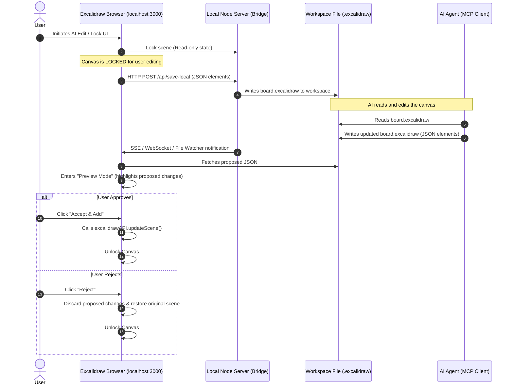

# Local Excalidraw MCP Integration Plan

Date: 2026-06-20

## 1. How It Works (Filesystem Bridge Pattern)

Instead of complex cloud databases, we use the local **filesystem** as the bridge. The browser canvas and the AI Agent talk through a local `.excalidraw` file in the workspace.

---

## 2. Confirmed Design Choices

### 1. File Strategy (FS)
* **Standard `.excalidraw` format** (Single JSON file containing `elements`, `appState`, and binary `files` mappings).
* **Rationale**: This is the official native Excalidraw standard. Keeping it as a single standard file allows upstream serializers and parsers to work out-of-the-box, making model ingestion straightforward.

### 2. Conflict Handling (CH)
* **Canvas Lock**: The canvas is set to **Read-Only** (locked) while the AI is editing/generating to prevent inconsistencies and race conditions.

### 3. Approval Flow (AF)
* **Preview and Add / Reject**: The user is shown a visual preview overlay of the proposed changes. They can choose to:
  * **Accept & Add**: Merge the proposed elements into the live scene.
  * **Reject**: Dismiss the changes and unlock the canvas.

---

## 3. Step-by-Step Implementation Blueprint

### Part A: Local Node Server (Bridge)
* Create a simple local helper server (e.g. `server.mjs` inside `/packages/local-bridge`) that:
  1. Watches `board.excalidraw` for changes and emits events to the browser.
  2. Exposes API endpoints for locking/unlocking states and saving JSON.

### Part B: Browser Frontend Integration
* In `excalidraw-app`:
  1. Set canvas to read-only during active AI runs.
  2. Auto-save scene state on user-initiated AI commands.
  3. Implement **Preview UI Overlay** (diff view) displaying proposed changes.
  4. Provide **Accept & Add** and **Reject** control actions.

### Part C: The MCP Server (`excalidraw-mcp`)
* Expose tools:
  * `read_canvas`: Reads the local `.excalidraw` file.
  * `update_canvas`: Overwrites/proposes scene updates.

### Part D: Agent Configuration
* Reference the local MCP server in the agent config (e.g., `.codex/config.toml`).
