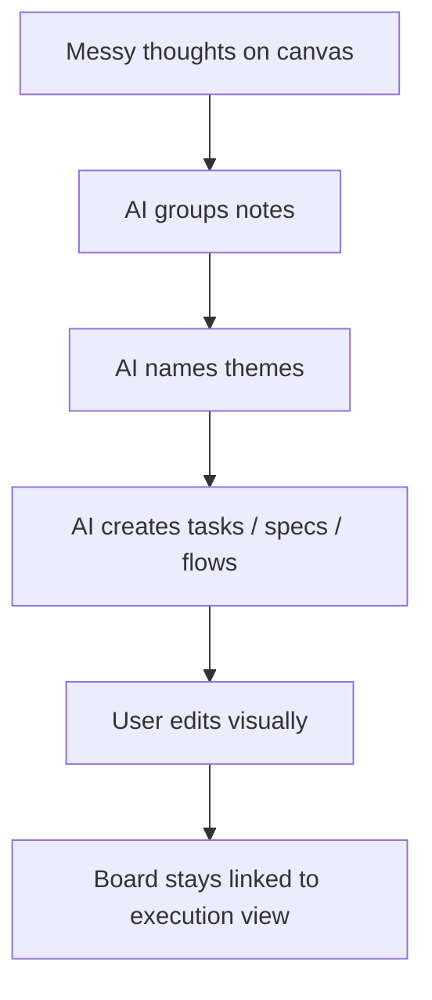

# Miro: Simple User View

Observed in your Miro workspace on 2026-06-18:
- Dashboard with `Home`, `Recent`, `Starred`, `Your recordings`, `Spaces`
- Quick starts like `Blank board`, `AI Playground`, `Kanban Framework`, `Sprint Planning`, `Roadmap Planning`, `Flowchart`
- Board tools like `Sticky note`, `Text`, `Shapes and lines`, `Pen`, `Frame`, `Comment`, `Present`, `Share`, `Export`, `Sidekicks`

## What Miro Is

Miro is a visual collaboration workspace.

People use it when they want to think on a canvas first, and structure later.

## What Users Commonly Use It For

1. Brainstorming with sticky notes.
2. Running workshops and retros.
3. Planning sprints and roadmaps visually.
4. Making flowcharts, UML, journey maps, diagrams.
5. Team reviews, comments, async feedback.
6. Presenting ideas directly from the board.
7. Starting from templates instead of blank work.

## Main Things A User Feels In Miro

### 1. Canvas-first
You open a board and start dropping ideas fast.

### 2. Template-first
Miro pushes ready-made starting points:
- retros
- kanban
- UML
- sprint planning
- roadmap
- feature spec generation
- release notes generation
- QA test case generation

### 3. Collaboration-first
Users can comment, present, share, react, record, and review together.

### 4. AI is present near the workflow
From your workspace, AI is surfaced as:
- `AI Playground`
- `Sidekicks`
- AI-oriented templates

## Simple User Flow

## Why People Like Miro

1. Very low friction to start.
2. Good for messy thinking.
3. Visual collaboration feels natural.
4. Templates reduce blank-page fear.
5. One board can mix notes, diagrams, planning, and review.

## Where Miro Is Weak

1. Ideas can stay messy for too long.
2. Harder to turn freeform canvas into execution automatically.
3. Boards can become large and noisy.
4. Task ownership and status are weaker than Jira-style tools.

## What Excali AI Should Learn From Miro

1. Start from a canvas, not a form.
2. Make templates a first-class entry point.
3. Let AI appear at the moment of creation, not as a separate product.
4. Keep collaboration lightweight: comments, reactions, share, present.
5. Help users go from messy board to useful structure fast.

## Best Ideas To Borrow

1. `Blank board + smart prompts`
2. `Template gallery for common jobs`
3. `AI-assisted board creation`
4. `Frame-based storytelling/presentation`
5. `Quick transform`: note -> task, cluster -> theme, sketch -> diagram

## Excali AI Opportunity

Miro is strong at:
- idea generation
- visual collaboration
- template-driven starts

Excali AI should beat it by doing one more thing:

`Turn a raw board into a structured output automatically.`

## Excali AI Direction From Miro

